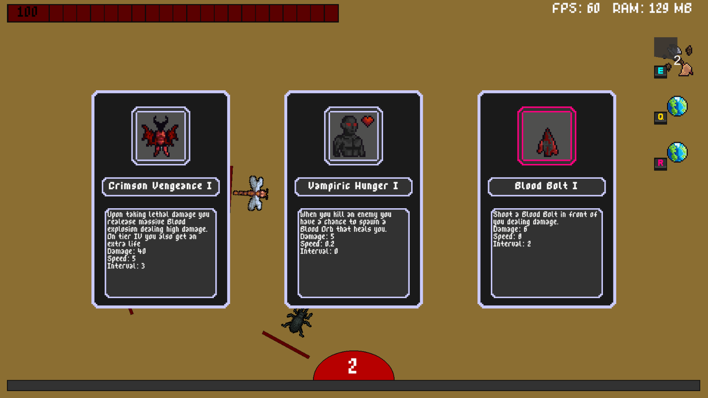

# BugWeight

**BugWeight** is a fast-paced 2D rogue-lite platformer developed in Unity. Inspired by *Vampire Survivors*, this game flips the roles—**you are the vampire**, and your goal is to survive endless swarms of insects.

The name *BugWeight* is a nod to the **Flyweight** design pattern used extensively in the game's architecture, alongside **Singletons** and **Object Pooling** for better performance and memory optimization.

---

## 🚀 How to Play

1. Clone the repository:  
```bash
   git clone https://github.com/ValdemarPospisil/BugWeight.git
```
3. Open the project in Unity (version 6.0.0 or newer).
4. Build & Run the game from Unity.

Currently, the game is not yet available on itch.io or other platforms.

---

## 🎮 Controls

| Key      | Action                        |
|----------|-------------------------------|
| `WASD`   | Move                          |
| `E`      | Activate Special Ability 1    |
| `Q`      | Activate Special Ability 2    |
| `R`      | Activate Special Ability 3    |
| Mouse    | UI interactions / Menus      |

---

## ✨ Features

- **Start with 1 Special Ability**, unlock up to 3 total.
- **Level up every 5 levels** (0, 5, 10...) to unlock or upgrade Special Abilities.
- Gain **XP by killing bugs** (enemies). On level-up, choose from:
  - A **Special Ability** (every 5 levels)
  - A **PowerUp** (other levels)
- **Each Special Ability** can be upgraded to **Tier I → IV**
- **PowerUps** are passive and activate automatically or periodically.
- **Procedurally generated background** for visual variety in each run.

---

## 🧛 Special Abilities

| Name            | Description |
|-----------------|-------------|
| **Bat Swarm** | Transform into a swarm of bats, becoming invincible and damaging enemies on contact. |
| **Blood Clone** | Creates a clone and turns invisible. After a short time, the clone explodes dealing damage. |
| **Blood Surge** | Become a controllable surge of blood that leaves behind a damaging mist trail. |
| **Death Toll** | Counts enemies killed since last use and kills the same number instantly on activation. |
| **BeastForm** | Transform into a werewolf with temporary abilities: `Bite`, `Howl` (freezes enemies), and `Summon Wolves`. Reverts after a short time. |
| **Necrotic Vortex** | Pulls nearby enemies into a vortex and deals damage over time. |
| **ShadowStep** | Teleports forward a short distance and leaves behind a shadow that explodes after a delay. |

---

## 🩸 PowerUps

| Name               | Description |
|--------------------|-------------|
| **BloodBolt**      | Automatically fires blood arrows. Higher tiers increase projectile count. |
| **Corpse Explosion** | Enemies have a chance to explode on death, damaging others nearby. |
| **CursedTouch**    | Enemies that touch the player have a chance to be cursed, taking periodic damage. |
| **Ethereal Form**  | Temporarily turns the player invisible. |
| **Shadow Slash**   | Periodically performs a shadow slash in front of the player. |
| **Vampiric Hunger**| Enemies have a chance to drop healing orbs on death. |
| **Wolf Summon**    | Summons an invincible wolf that attacks enemies automatically. |
| **Wolf Sacrifice** | On death, sacrifices a wolf (if available) to fully revive the player. |

---

## 🖼️ Images & GIFs

- 
- 
- 
- 
- 

---

## 🛠️ Tech Stack

- **Unity Engine**
- **C#**
- **Design Patterns**: Flyweight, Singleton, Object Pooling
- **Procedural Generation** for dynamic backgrounds

---

## 📌 Note

This project is still in active development. More features, polish, and balance updates are coming soon!

---

## 📧 Contact

If you'd like to contribute, report a bug, or just say hi — feel free to open an issue or reach out!
